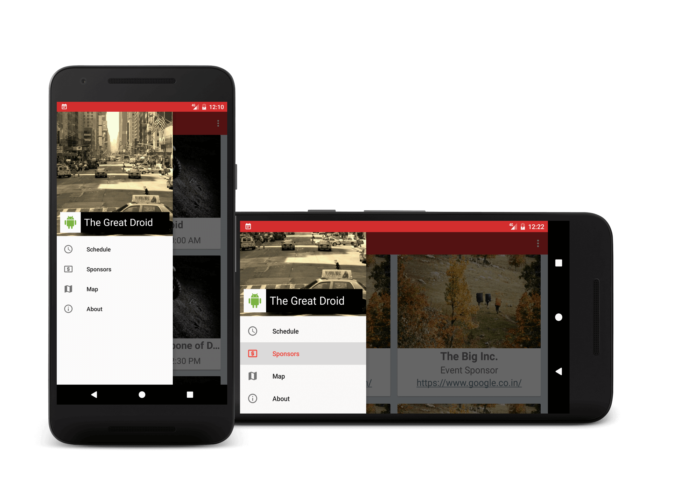
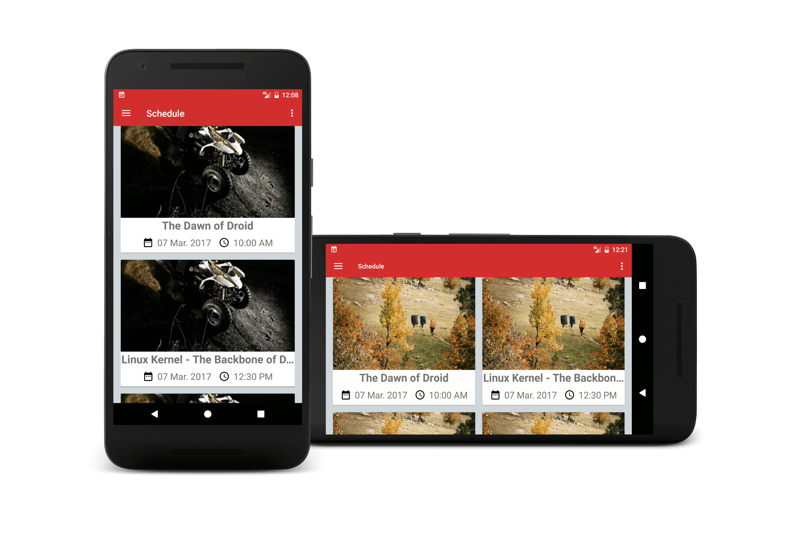
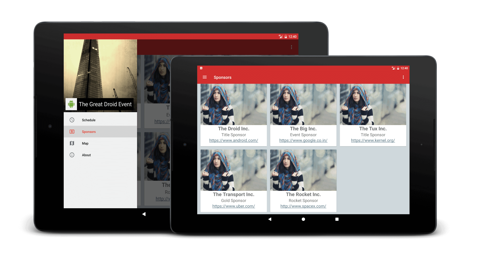
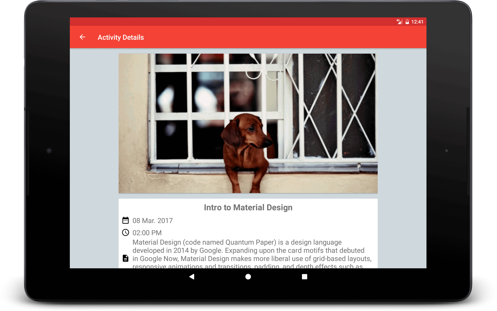
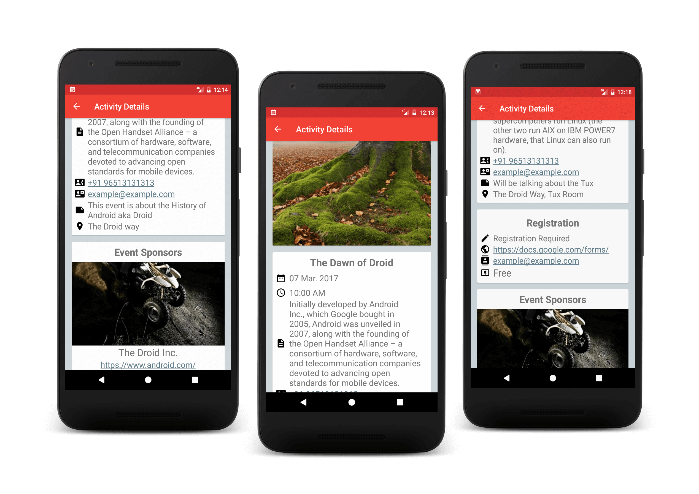
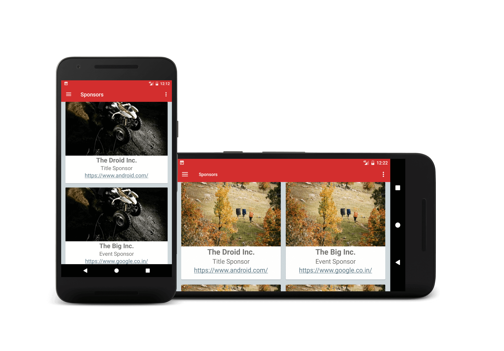
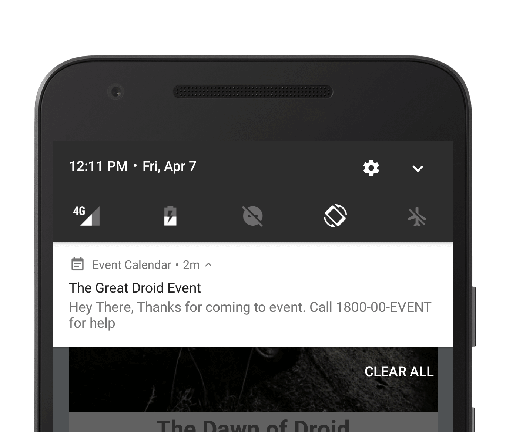
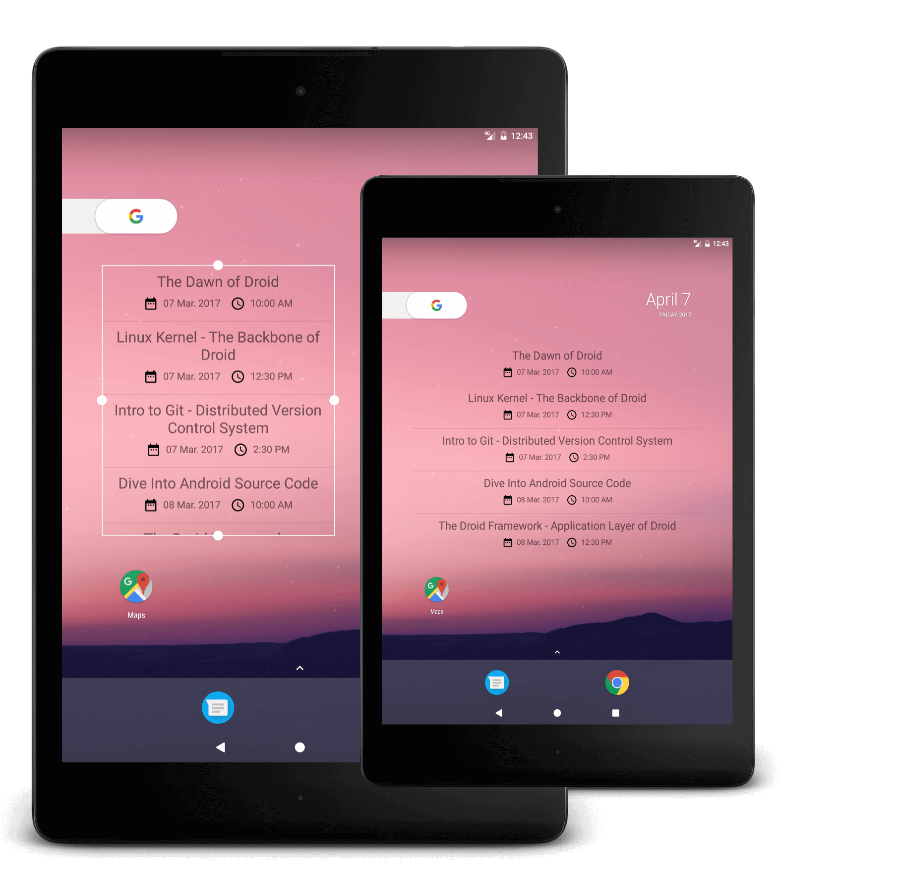
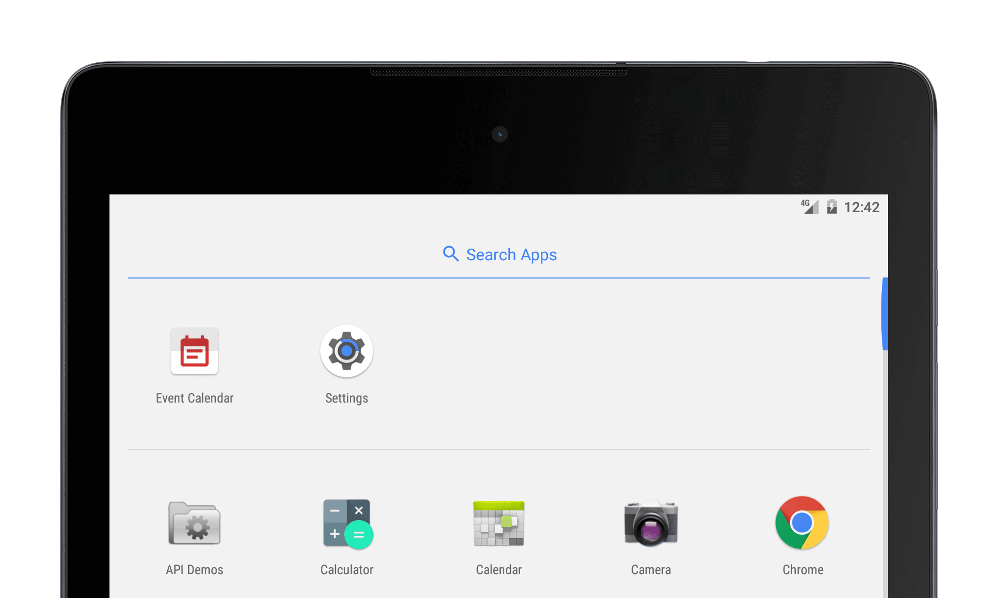

<p align="center">

</p>

# Event Calendar
📅 Final(Capstone) project for Udacity Android Nano Degree

# Description
This app aims to provide a boilerplate app for building a simple and robust app as a calendar for
your event.

Using the provided JSON file (which can be hosted on your server along with Assets for the
event) Event Organizers can manage the content of the App and update it without releasing an
update.

After looking at Google I/O app we had inspiration for building the similar app for our university’s
Techno-cultural fest. But ran into few hurdles like Time and Resources Required to build a
production-ready app that can be used as an Event calendar, an app in which Event organiser
can update data without releasing an app update.
So I built this, It aims to provide a simple app that can be customized via simple JSON file.

#### See more
- [Docs](docs)
- [Capstone_Stage1.pdf](docs/Capstone_Stage1.pdf)

## Building

0. Clone and import into Android Studio

1. get a Awareness API KEY and put it in
`<string name="awareness_api_key" templateMergeStrategy="preserve" translatable="false">YOUR_API_KEY</string>`
if you want to use the GeoFence Feature

2. Host you JSON file on public internet, see [demo JSON file here](public-assets/eventdata.json)
(you can use this demo file for testing or during development) [DEMO JSON FILE](https://api.myjson.com/bins/nedbz)
See [JSON file objects/data is explained here](docs/JSON_data_file explained)

3. Put your JSON file URL in
`<string name="data_json_file_url">YOUR_JSON_FILE_URL</string>`

4. Build it

**NOTE : to make signed apk you have to setup keystore [Sign Your App](https://developer.android.com/studio/publish/app-signing.html)**

#### I am including a dummy keystore pre configured but do not use that to sign production apps, it is for developemtn use ONLY

5. add your signingConfigs in [build.gradle file](app/build.gradle)
```
signingConfigs {
    release {
        storeFile file('KEY_STORE_PATH_GOES_HERE')
        storePassword "YOUR_STORE_PASSWORD_GOES_HERE"
        keyAlias "YOUR_KEY_ALIAS_GOES_HERE"
        keyPassword "YOUR_KEY_PASSWORD_GOES_HERE"
    }
}
buildTypes {
    release {
        signingConfig signingConfigs.release
        minifyEnabled false
        proguardFiles getDefaultProguardFile('proguard-android.txt'), 'proguard-rules.pro'
    }
}
```
6. Distribute to users, to update the content of app Just edit the Hosted JSON file, you can utilise the Geo-fence based notifications feature to broadcast messages to event attendees who are in event location GeoFence


## SDK version

    minSdkVersion 19
    targetSdkVersion 25

## Screenshots
<p align="center">











</p>

see `Screenshots` folder for more

# Contributing
You are encouraged to file bug reports(issues) and make pull requests

# License
#### Apache 2.0

```
Copyright [2017] [Suraj Nath]

Licensed under the Apache License, Version 2.0 (the "License");
you may not use this file except in compliance with the License.
You may obtain a copy of the License at

    http://www.apache.org/licenses/LICENSE-2.0

Unless required by applicable law or agreed to in writing, software
distributed under the License is distributed on an "AS IS" BASIS,
WITHOUT WARRANTIES OR CONDITIONS OF ANY KIND, either express or implied.
See the License for the specific language governing permissions and
limitations under the License.
```